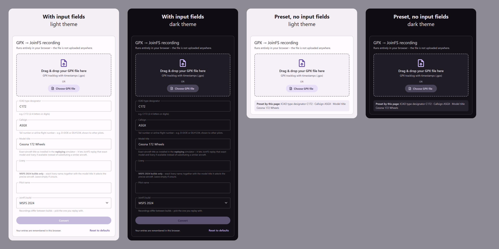
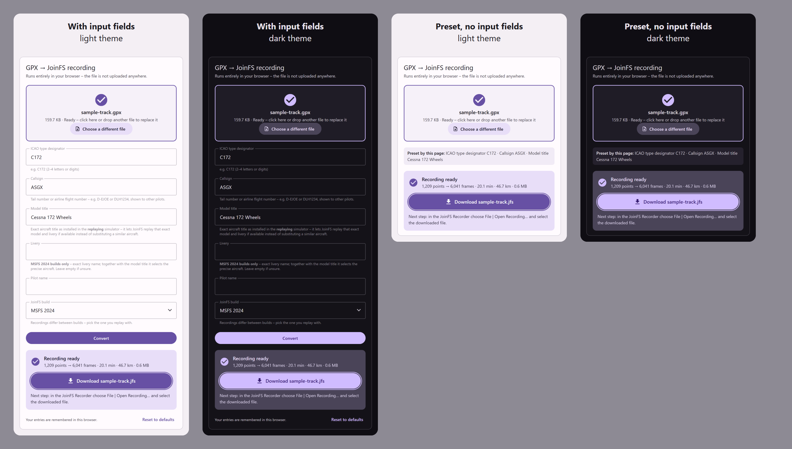

# joinfs-gpx2jfs-converter-webcomponent

A self-contained web component, `<joinfs-gpx-to-jfs>`, that converts a **GPX tracklog into a JoinFS recording
(`.jfs`)** in the browser, so it can be replayed in the JoinFS Recorder. Nothing is uploaded; there is no server
code, build step or runtime dependency. It also derives gear, flaps and lights from the track.

```html
<joinfs-gpx-to-jfs></joinfs-gpx-to-jfs>
<script src="joinfs-gpx-to-jfs.js"></script>
```

- Drop zone and file picker, a clear download button, progress bar and cancel.
- Aircraft settings (ICAO type, callsign, model title, ...) with presets via attributes or URL parameters, remembered
  in the browser.
- Material Design look, responsive (320 px and up), light and dark theme following the browser setting.
- Lazy-loaded language files (English built in, German included), English as the fallback.
- Tested unit-wise, in jsdom and in a real Chromium.

This is an independent tool and not affiliated with JoinFS. See [License](#license).

## Screenshots

Before a file is loaded, with all input fields and with everything preset (no input fields), in light and dark theme:



After a conversion, with the download button:



The single images are in `docs/screenshots/`; `npm run screenshots` regenerates them.

## Demo

Serve the repository with any static web server and open `demo/index.html`:

```sh
npx serve .            # or: python3 -m http.server
```

`demo/sample-track.gpx` is a synthetic flight you can drop on the page. Language files are fetched with
`fetch()`, so the demo needs http(s); opened straight from disk it works but stays English.

## Use it

Copy the files from `src/` into one folder of your site (the language files must sit next to the script):

| File | Purpose |
|---|---|
| `joinfs-gpx-to-jfs.js` | Component, converter and built-in English texts |
| `joinfs-gpx-to-jfs.de.json` | German texts, lazy-loaded when the browser prefers German |
| `joinfs-gpx-to-jfs.en.json` | Template for translators (identical to the built-in English texts) |

Then add the script and the tag as shown above. The user flow is:

1. Drop a GPX file on the dashed area or click **Choose GPX file**.
2. Check the aircraft settings and press **Convert** (skipped when everything is preset, see below).
3. Press the big **Download …jfs** button, then in the JoinFS Recorder choose *File | Open Recording…*.

The GPX needs timestamps. Heading, pitch and bank are derived from the track (see
[What the converter does](#what-the-converter-does)).

## Attributes and URL parameters

| Setting | Attribute | URL parameter | Values |
|---|---|---|---|
| ICAO type designator | `icao-type` | `icao` (or `icao-type`) | 2–4 letters/digits, default `C172` |
| Callsign | `callsign` | `callsign` | up to 16 chars, default `ASGX` |
| Model title | `model` | `model` | up to 128 chars, default `Cessna 172 Wheels` |
| Livery | `livery` | `livery` | up to 128 chars, empty by default; MSFS 2024 builds only, the field is hidden for the others |
| Pilot name | `nickname` | `nickname` | up to 32 chars (empty is allowed) |
| JoinFS build | `build` | `build` | `fs2024` (default) or `other` |

These settings have **no input field** — they are properties of the recording rather than questions for the pilot.
Each is taken from the attribute or URL parameter, or stays at its default:

| Setting | Attribute | URL parameter | Values |
|---|---|---|---|
| Aircraft systems | `systems` | `systems` | `full` (default) or `off`, see [Gear, flaps and lights](#gear-flaps-and-lights) |
| Type role | `typerole` | `typerole` | `unknown` (default), `singleprop`, `twinprop`, `airliner`, `rotorcraft`, `glider`, `fighter`, `bomber`, `fourprop`, `airship`, `balloon` |
| Frame rate | `hz` | `hz` | 1–30, default `5` |
| Altitude offset | `altitude-offset` | `altitude-offset` (or `alt-offset`) | metres, –500–500, default `0` |
| Position smoothing | `smooth-pos` | `smooth-pos` | seconds, 0–10, default `3`; `0` disables |
| Ground clearance | `ground-clearance` | `ground-clearance` | metres, 0–20, or `none` (default) |

**Position smoothing** low-passes the resampled track, and on a real tracklog it is the difference between an
aircraft that flies and one that surges fore and aft.

The resampler interpolates *through* every source point (cubic Hermite with Catmull-Rom tangents), so GPS noise is
not averaged away but amplified: each tangent is a difference of neighbouring points, and the spline overshoots
between them. A 1 Hz tracklog with a metre of noise per sample comes out with its speed swinging by **10 knots or
more at about half the sample rate**. The simulator follows that, because it drives the injected aircraft from the
velocity in the recording — zero those velocities and the aircraft drops out of the sky. Smoothing the positions
removes the oscillation at its source; the written velocity is their derivative, so it becomes smooth with them.

Measured on `demo/sample-track.gpx` (speed swing around its own trend):

| `smooth-pos` | 0 | 1.5 | 3 (default) | 5 |
|---|---|---|---|---|
| swing | 6.3 kt | 3.5 kt | 1.8 kt | 1.1 kt |
| moved by | – | 0.8 m | 1.9 m | 3.7 m |

**The right value depends on your track, so measure it:**

```sh
npm run track-noise -- path/to/your.gpx
```

That prints the same table for your own file and names the smallest window that gets the swing under 2 kt. A clean
track needs none; a rough one may want 5 s or more. "Moved by" is an upper bound on lost detail — on a noisy track
most of it is the noise being removed, and it only costs you where the raw track was telling the truth, such as a
landing flare.

Raising the frame rate (`hz`) also helps and the two compose, but smoothing attacks the cause and costs no file
size. If even a large window leaves too much swing, the limit is the interpolating spline itself; replacing it with
a fitting (least-squares) one would denoise without blurring, and has not been done.

The **ground clearance** is written into the recording as STATIC CG TO GROUND (file version 21008 and up): how far
the recorded altitude sits above the point where the wheels touch. A GPX does not say — it carries a receiver
somewhere in a cabin, not an aircraft geometry — so the default is `none`, written as NaN, which JoinFS reads as
unknown and takes as a reason to skip its ground-clearance correction rather than guess.

**Do not set this to `0`.** JoinFS cannot tell a declared zero from an aircraft that genuinely sits flush on the
ground, so it adds the *substitute* model's entire clearance on top of every altitude — the JoinFS source names
that as the cause of its own "hovers meters above the ground" behaviour. Give it a real figure only if you know
the one for the aircraft that was recorded.

The **altitude offset** shifts every written altitude, and the ground reference with it, so relative height, the
on-ground detection and the gear/flaps/lights timing are all unchanged. Use it when the replayed aircraft sits above
or below the terrain: a GPX carries whatever elevation datum its recorder used, and that need not agree with the
simulator's terrain mesh. Read the error off the simulator and put the negative of it here – if the aircraft hovers
8 m up, use `altitude-offset="-8"`. Correcting it in the file rather than with JoinFS's own height adjustment means
the fix also applies in shared cockpit, which that adjustment does not reach.

The **frame rate** is how often a position is written; the track is resampled onto that grid. 5 Hz is plenty for a
smooth replay, because JoinFS interpolates between frames. Raising it makes the file proportionally bigger without
adding detail the GPX does not have – a 20-minute track is 0.57 MB at 5 Hz, 2.23 MB at 20 Hz – so raise it only
when you actually need the denser grid. Very long tracks are refused at high rates ("the track is too long for the
chosen frame rate"); lower the rate for those.

**Leave the type role alone unless you know it is right.** JoinFS does not derive it from the ICAO type designator
when it replays a recording: it reads the byte from the file and feeds it straight into model matching, which awards
+15 for a matching type role but **−240 for a mismatch** when the ICAO type is not an exact hit — enough to push an
otherwise good substitute below the match threshold. `unknown` (0) makes JoinFS skip the comparison altogether and
match on the ICAO type designator instead, from which it derives the Doc8643 class code and wake-turbulence category
itself. A wrong value is worse than no value.

- A **valid value presets the setting and hides its input field.** A short read-only line shows the preset
  aircraft values. Invalid values are ignored (the field stays visible).
- If **no field is left visible**, the Convert button is hidden and the file is converted as soon as it is loaded
  (`auto-convert` forces this in general).
- URL parameters win over attributes; `no-url-params` switches them off.
- `editable` keeps all fields visible and uses attribute/URL values only as **defaults**.
- `flaps-takeoff` and `flaps-landing` (0–1, default `0.2` and `1`) set the flap handle position for takeoff and
  landing. They are attributes only, without an input field.
- The three aircraft defaults are the assumed standard MSFS 2024 Cessna 172 values; please check them against your
  simulator.
- **Model title and livery are what pick the aircraft.** JoinFS first looks for an installed model whose title
  matches exactly -- on the MSFS 2024 build, title *and* livery both have to match -- and replays that one. Only
  when nothing matches does it score the remaining attributes and substitute a similar aircraft, and there the
  livery is the weakest signal of all (one point per shared word). The livery string exists in the MSFS 2024 file
  layout only, so the Livery field is hidden whenever the JoinFS build is set to anything else; the value is kept,
  so switching back brings it up again.

Example: `demo/index.html?icao=C172&callsign=ASGX&model=Cessna%20172%20Wheels`

### Remembered settings

Visible fields are stored in `localStorage` (key `joinfs-gpx-to-jfs:v1`, change with `storage-key`), so a user who
always flies the same aircraft does not have to retype anything. The defaults stay visible as placeholders;
**Reset to defaults** clears the stored values. Preset (hidden) values are never stored. If `localStorage` is
blocked, everything works but nothing is remembered.

## Languages

English is built in. Other languages are **lazy-loaded** as `joinfs-gpx-to-jfs.<locale>.json` from the folder the
script was loaded from (override with `locale-base="/path/"`):

1. The browser's preferred languages (`navigator.languages`) are tried in order. For `de-AT` the files
   `joinfs-gpx-to-jfs.de-AT.json`, then `joinfs-gpx-to-jfs.de.json` are requested.
2. The first file that exists is used. If English comes first in the preference list, or none of the preferred
   languages has a file, the built-in English texts are used.
3. Missing keys in a translation fall back to English individually, so partial translations are fine.

`lang="de"` on the element or `?lang=de` in the URL forces a language.

**Add a language:** copy `joinfs-gpx-to-jfs.en.json` to `joinfs-gpx-to-jfs.<locale>.json` (e.g.
`joinfs-gpx-to-jfs.fr.json`), translate the values and keep the `{placeholders}` unchanged. No code changes are
needed; `npm test` checks that a translation is complete and has matching placeholders.

## Styling: responsive, light and dark

- **Responsive:** the component fills the width of its container (up to 34 rem, change with `--gj-max-width`). It
  stays usable down to 320 px, long file names wrap instead of overflowing, and touch screens get 48 px buttons.
- **Light/dark:** it follows the browser/OS setting (`prefers-color-scheme`), including the native select
  dropdowns. Force a scheme with `theme="light"` or `theme="dark"` (default `auto`), for example to follow a theme
  switch on your own page.
- **Colours:** override with CSS variables on the element: `--gj-accent`, `--gj-on-accent`, `--gj-bg`, `--gj-fg`,
  `--gj-muted`, `--gj-outline`, `--gj-border`, `--gj-placeholder`, `--gj-error`, `--gj-container`,
  `--gj-on-container`, `--gj-error-container`, `--gj-on-error-container`. A variable applies to both schemes, so set
  it inside a `prefers-color-scheme` rule if you want different values per scheme.
- The card and drop zone are exposed as `::part(box)` and `::part(dropzone)`.

## Gear, flaps and lights

Unless `systems` is `off`, the converter adds gear, flaps and lights to the recording. They are derived from the
track (thresholds are options of `Gpx2Jfs.convert`; ground speed is used for all speeds):

| | Rule |
|---|---|
| Flaps, takeoff | 20 % from the start. They retract when the aircraft reaches start elevation + 200 ft if the speed is below 140 kt at that moment, otherwise at + 1000 ft. |
| Flaps, landing | Extended in stages as the aircraft slows, each stage keyed to how far it still is above the speed it will actually touch down at: 33 % at touchdown speed + 40 kt, 67 % at + 30 kt, 100 % at + 20 kt (`flapsLandingSteps`, `flapsLandingVtdMarginKt`). Every stage also has to be close enough for the slowdown to be an approach — within 7 nm, and within 1.5 nm once below 100 kt for full flaps. At least 20 s between stages, so an aircraft that decelerates quickly still extends them visibly rather than in one jump. After touchdown they go up again below 30 kt. |
| Gear | Up together with the takeoff flaps, down 1 nm (along the track) before the flaps-full point — which on a normal approach puts it after the first flap stages. The handle is written for fixed-gear aircraft too; the simulator is expected to ignore it. |
| Nav, beacon | On for the whole track. |
| Strobe | On from the start of the takeoff roll until the runway is vacated (below 30 kt after touchdown). |
| Landing light | On at 4000 ft above the ground reference or lower, off again above 4300 ft (300 ft hysteresis), between the start of the takeoff roll and vacating the runway. The reference moves linearly from the start to the end elevation. |
| Taxi light | On from the first movement until the takeoff roll starts, and again after vacating the runway. |

Every event is found once over the whole track and then latched, so speed noise around a threshold cannot make a
setting flip back and forth. Only the ground contact is debounced (5 s). The rules assume one takeoff and one final
landing; touch-and-go patterns in between are not treated separately.

The simulator maps the flap value to the nearest detent, so a value like 20 % may land on flaps up on an aircraft
with few detents. Adjust `flaps-takeoff` for your aircraft, and `flapsLandingSteps` if its approach flap settings
are not thirds.

How it is stored: `GEAR HANDLE POSITION`, `FLAPS HANDLE PERCENT`, `LIGHT STATES` (the bit mask that drives the
lights, plus its per-bit mirrors) and `LIGHT STROBE` as timestamped variable frames. The variable IDs are hashes of
the lower-cased SimVar names, as in the JoinFS source. The state is written at every change, at the start and then
every 5 s, because the replay aircraft may only appear a moment after playback starts. This adds about 80 KB per
hour of flight.

## What the converter does

A GPX only contains position, altitude and time, so:

- The 1 Hz track is smoothed with a cubic spline and written at 5 Hz (the `hz` attribute / URL parameter, or the
  API option of the same name; JoinFS interpolates between frames by their timestamps, so the rate only affects
  smoothness and file size). Long standstills in the track are held in place, other long gaps are bridged in a
  straight line.
- **Heading** = course over ground, **pitch** = flight-path angle plus a 2° trim, **bank** = coordinated-turn bank
  from the heading rate (clamped to ±45°). Sign conventions follow JoinFS: positive pitch = nose down, positive bank
  = left wing down.
- **Ground** = within 8 m of the start/end elevation and below 90 kt.
- Not recorded: engines and anything else besides gear, flaps and lights.

### The recording format

Little-endian, written like a .NET `BinaryWriter`; units are radians, metres and m/s.

```
int16   version                       21008 (21005 = without static CG field, 21003 = also without ICAO strings)
int32   aircraft count                1
  bool    plane
  string  callsign, nickname, model   7-bit length prefix + UTF-8
  byte    type role                   0 unknown, 1 single prop ... 10 balloon
  int32   frame count
    frame: byte type, double time (s since start), payload
      1  aircraft position: lat, lon, alt (doubles); pitch, bank, heading; velocity, angular velocity,
         acceleration (3 floats each); rudder, elevator, aileron, brakes (int16, value * 16384); elevation (float);
         flags (byte, bit 0 = on ground)
      11 integer variables: uint16 count, then (uint32 id, int32 value)
      12 float variables:   uint16 count, then (uint32 id, float value)
  string  livery                      MSFS 2024 builds only
  string  ICAO type, ICAO airline
int32   object count                  0
```

**The JoinFS build matters:** recordings written by the MSFS 2024 build contain the extra livery string, so a file
made for one layout cannot be read by the other. The `build` setting selects the layout. Version 21005 is the first
that stores the ICAO type. JoinFS documents the format in `docs/recording-protocol.md` of its repository.

## JavaScript API

```js
Gpx2Jfs.convert(gpxText, options)            // -> { data: Uint8Array, info }   (synchronous)
Gpx2Jfs.convertAsync(gpxText, options, { onProgress, signal })   // Web Worker, falls back to the page thread
Gpx2Jfs.DEFAULTS                              // all options with their defaults
Gpx2Jfs.messages.en                           // built-in UI texts
```

Options include `icaoType`, `callsign`, `model`, `nickname`, `typerole`, `hz`, `jfsVersion`, `fs2024`, `systems`,
`flapsTakeoff`, `flapsLanding` and the thresholds listed in `DEFAULTS`. Errors are `Gpx2Jfs.GpxError` with a `code`
(and `params`) that the UI translates.

Events on the element: `converted` (`detail = { info, blob, filename }`) and `locale-loaded`
(`detail = { locale }`).

The heavy part runs in a Web Worker created from a Blob of the same file (progress bar and Cancel button). If a
worker cannot be started (for example a strict CSP without `worker-src blob:`), it falls back to the page thread.

## Development

Requires Node 22.22+ / 24.15+ (jsdom 30); the component itself needs nothing.

```sh
npm install
npm test                 # unit, component (jsdom), locale and reference tests
npm run test:browser     # real-browser tests (optional packages puppeteer-core + @sparticuz/chromium)
npm run test:all
npm run sample           # regenerate demo/sample-track.gpx
npm run screenshots      # regenerate docs/screenshots (needs the optional browser packages)
npm run track-noise -- x.gpx   # how much a track surges, and what smooth-pos costs to stop it
```

`@sparticuz/chromium` ships a Linux binary only, so on Windows and macOS the browser tests skip and the screenshot
tool fails. Point `CHROME_PATH` at a locally installed Chrome or Edge to run them anyway:

```sh
CHROME_PATH="/c/Program Files/Google/Chrome/Application/chrome.exe" npm run test:browser
```

| Suite | Covers |
|---|---|
| `test/converter.test.js` | GPX parsing, file layout for all three layouts, heading/pitch/bank and their signs, gaps, gear/flaps/lights rules (hysteresis, speed + distance rule, gear timing, options), worker path, snapshot hash |
| `test/reference.test.js` | Retired: the converter and the Python reference have intentionally diverged (see the note in the file) |
| `test/component.test.js` | Presets, URL parameters, drop zone, download, persistence, type role, aircraft systems, languages (jsdom) |
| `test/locales.test.js` | Every language file is complete and has matching placeholders |
| `test/browser/browser.test.js` | Full flow with the Web Worker, drag and drop, real HTTP locale loading, colour schemes, 320–1280 px layout |

All test data is synthetic (`test/helpers/tracks.js`); no recorded flights are included. The recording layout was
also checked once with the reader from the JoinFS source, and the gear/flaps/lights variable IDs against its
variable lookup; those checks need the JoinFS sources and are not part of the test suite.

**Not yet checked:** Firefox and Safari, and replay in a running simulator, including whether the sim accepts the
gear/flaps/light variables on the replay aircraft. A short recording made in JoinFS with gear, flaps and lights
operated would settle that.

### Layout

```
src/         the component and its language files (ship these)
demo/        demo page and synthetic sample GPX
docs/        screenshots
test/        test suites, helpers (synthetic flights, independent .jfs decoder) and the runner
tools/       sample GPX generator, track-noise measurement, screenshots, retired Python reference writer
```

## License

The web component and everything else in this repository, unless noted otherwise, is licensed under the
[Creative Commons Attribution-NonCommercial-ShareAlike 4.0 International License](https://creativecommons.org/licenses/by-nc-sa/4.0/)
(CC BY-NC-SA 4.0); see [LICENSE](LICENSE). In short: you may share and adapt it, you must give appropriate credit,
indicate changes and link the license, you may not use it commercially, and adaptations must be shared under the
same license. This summary is not a substitute for the license text.

Please credit it as: *joinfs-gpx2jfs-converter-webcomponent, CC BY-NC-SA 4.0*, with a link to this repository.

The recording format and the variable-hash function come from JoinFS (MIT License); its notice is in
[NOTICE.md](NOTICE.md). The test-only dependencies keep their own licenses.
